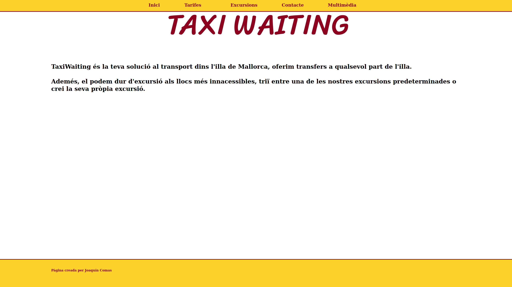
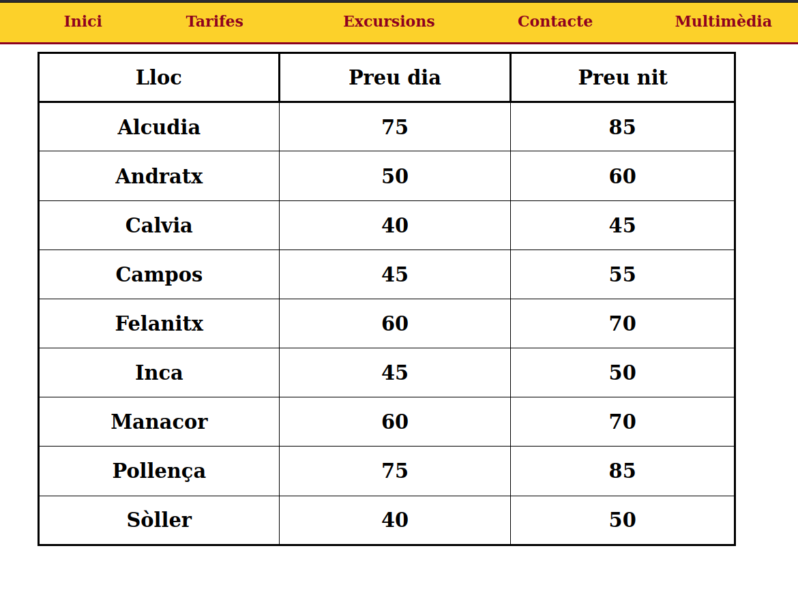
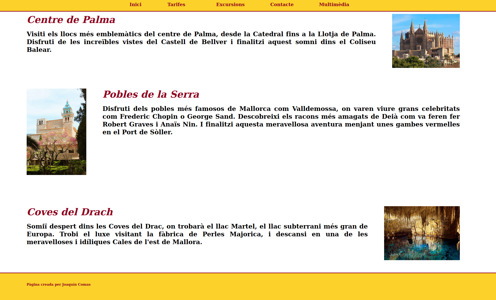
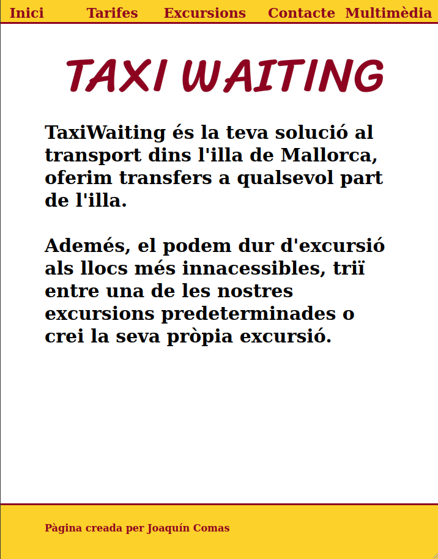

# WEB Responsive
## Estructura WEB
La pàgina inicial d'aquesta web es index.html, hi ha quatre pàgines més, tarifes.html, on se poder trobar els preus dels nostres serveis, excursions.html, on trobarem informació sobre serveis extra que s'ofereixen, contacte.html, on se pot trobar les diferents maneres per contactar amb nosaltres i multimedia.html, on hi ha diferents vídeos relacionats amb els nostres serveis. Ademés hi ha dos directoris, un anomenat css, on es troba l'arxiu d'estils i un altra anomenat img, on es troben totes les imatges utilitzades.

## Tecnologies usades
Hem fet servir html i css per fer servir aquestar WEB.

## Característiques 
Podem trobar informació i preus sobre els nostres serveis, informació per contactar amb nosaltres i una secció multimèdia de vídeos de l'illa de Mallorca.
## Captures de pantalla
### Pàgina principal

### Tarifes

### Excursions

### Pàgina principal per Mòbil

